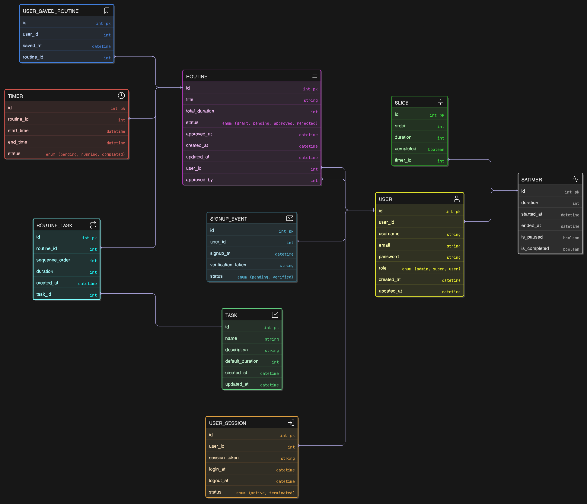
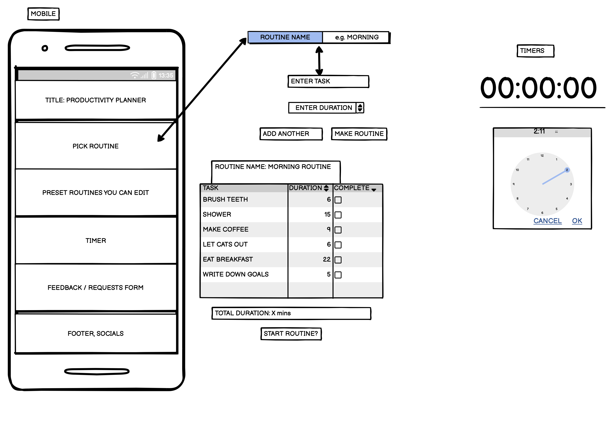
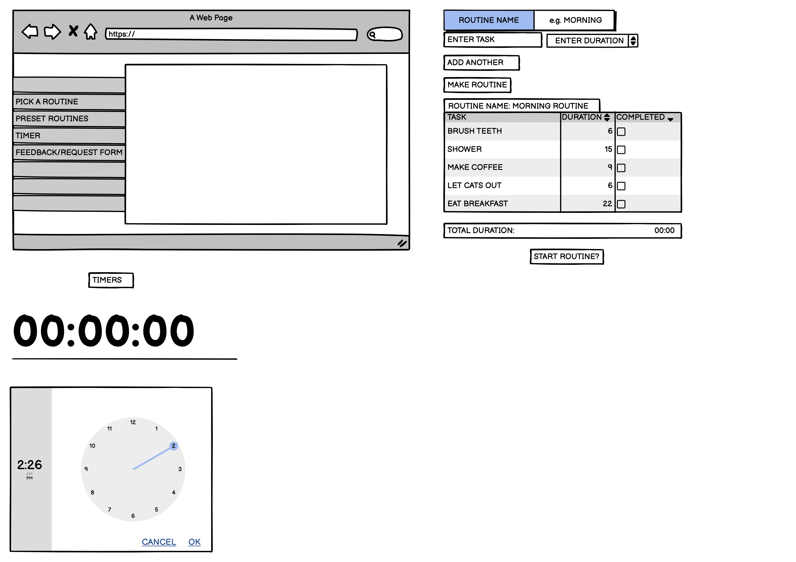
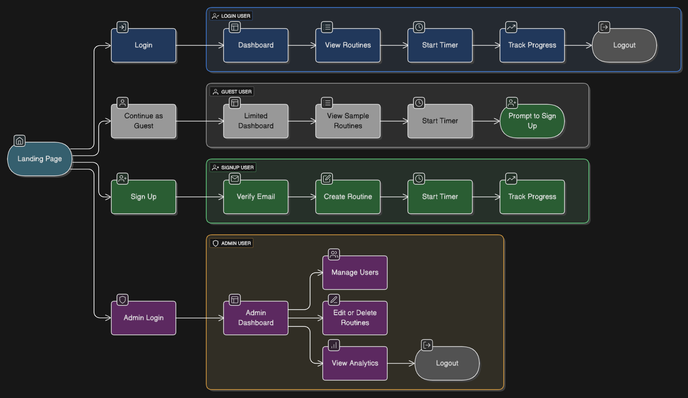
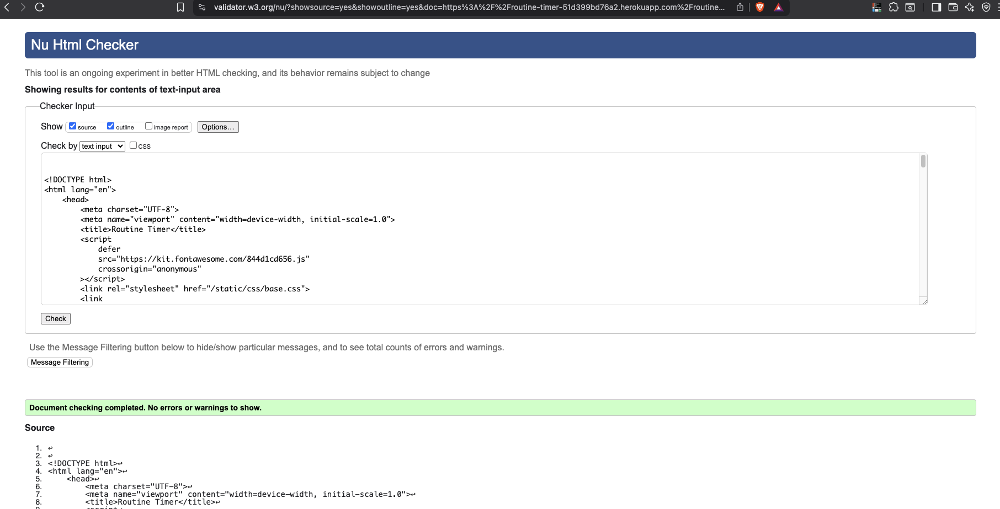
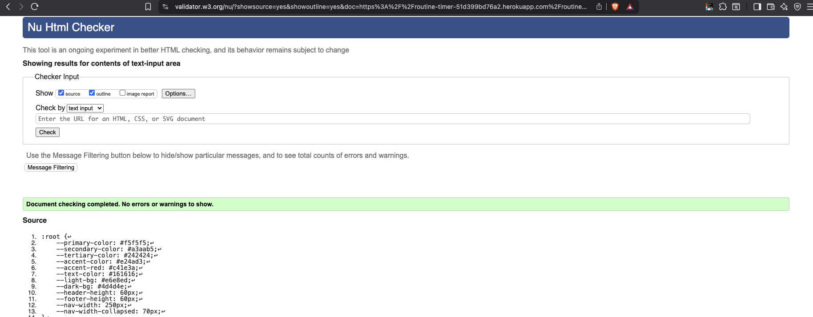
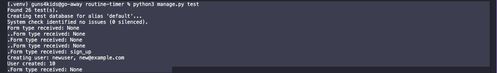
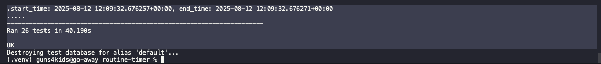

# routine-timer

Routine Planner App README

# Routine Timer App

TL/DR; A Django-based web application for planning, timing, and tracking routines.  
Users can create routines, add tasks, run timers, countdowns and manage sessions.  
Supports authentication, guest access, and admin management.

Deployed site: https://routine-timer-51d399bd76a2.herokuapp.com/
Github Repo: humanauction/routine-cap
Project Board: https://github.com/users/humanauction/projects/11/views/1

---

## Table of Contents

-   [Introduction](#introduction) 
-   [Methodology](#methodology)
-   [Features](#features)
-   [Project Structure](#project-structure)
-   [Tech Stack](#tech-stack)
-   [Design System](#design-system)
-   [Database Schema](#database-schema)
-   [Wireframes](#wireframes)
-   [User Flows](#user-flows)
-   [Validation](#validation)
-   [Running Tests](#running-tests)
-   [AI Collaboration](#ai-collaboration)
-   [Contributing](#contributing)
-   [License](#license)
-   [Thanks, etc…](#thanks)

---

## Introduction

## The Routine Planner App helps users design, save and run daily routines with an integrated timer. Minimal by design, clean, distraction-free interface keeps focus on productivity, while features like routine modification requests and saved routines enhance flexibility.

## Methodology

We followed agile principles, including Kanban and MoSCoW methods, so expect minimal documentation! MVP focused on delivering strong security principles and future scaling through modular design. We prioritized core features (routine CRUD, timer mode) in pre-production; Iterated on user feedback for MVP refinements; Held multiple, regular demo & retrospective sessions to adjust scope. This helped identify issues and solutions in advance as well as on the fly, specific examples include:
Feature
Benefit
Separate forms
Keeps view logic thin
Clean fields
Prevents injection
Centralised password rules
Django + custom validation, easier test, reuse, and auditing
Class-based views (CBVs)
Consistency, easy extension, clear lifecycle hooks (form_valid)

# Key User Stories:

As a user, I can create/edit/delete routines - Achieved.
As a user, I can run a routine in timer mode - Achieved.
As an admin, I can edit or delete a user routine - Achieved.

Project Board
A kanban board tracks progress. Columns: Backlog, In Progress, Review, Done. See: https://github.com/users/humanauction/projects/11/views/1 for details.

---

## Features

-   User authentication (login, signup, guest, admin).
-   Routine builder: create, edit, save routines.
-   Routine Countdown Timer: run routines, track progress, increment/decrement controls.
-   Productivity Timer: pie-chart, “pomodoro”-type countdown with segmentation control.
-   Responsive UI for desktop and mobile via AJAX.
-   Admin dashboard for managing users and routines.
-   Session tracking and event logging.

---

## Project Structure
```
routine-timer/
├── authentication/
│ ├── static/authentication/css/
│ ├── static/authentication/js/
│ ├── templates/authentication/
│ ├── models.py, views.py, forms.py, ...
├── home/
│ ├── static/home/css/
│ ├── static/home/js/
│ ├── templates/home/
│ ├── models.py, views.py, ...
├── routine/
│ ├── static/routine/css/
│ ├── static/routine/js/
│ ├── templates/routine/
│ ├── models.py, views.py, ...
├── timer/
│ ├── static/timer/css/
│ ├── static/timer/js/
│ ├── templates/timer/
│ ├── models.py, views.py, ...
├── static/
│ ├── css/
│ ├── js/
│ ├── images/
├── templates/
│ ├── base.html
│ ├── base_no_nav.html
│ ├── admin/
│ ├── registration/
├── manage.py
└── README.md
```
---

## Tech Stack

-   **Backend:** Django 4.x, Python 3.11+
-   **Frontend:** HTML5, CSS3 (custom), JavaScript (vanilla)
-   **Database:** PostgreSQL
-   **Icons:** Font Awesome
-   **Linting & Formatting:** ESLint, Prettier, Black -**Testing & Validation:** pytest, jest, manual, validator.w3.org
-   **Static files:** Managed via Django
-   **Devops:** GitHub, Heroku

---

## Design System

-   **Color Palette:**

primary-color: #f5f5f5;
secondary-color: #a3aab5;
text-color: #161616;  
accent-color: #e24ad3;  
light-bg: #e6e8ed;
dark-bg: #4d4d4e;
tertiary-color: #242424;
accent-red: #c41e3a;


-   **Font:**

    -   `"Atkinson Hyperlegible Mono", "Roboto Mono", sans-serif, monospace`

-   **Buttons:**

    -   Outline and filled styles, small and large variants
    -   Accessible color contrast

-   **Cards:**

    -   White background, visible border, subtle shadow

-   **Forms:**
    -   Clean, modern, with clear spacing and focus states

---

## Database Schema

See the ERD below for relationships and fields:

**Main tables:**

-   `user_session`: session tracking
-   `signup_event`: signup verification
-   `user`: authentication, roles
-   `routine`: routines created by users
-   `routine_task`: tasks within routines
-   `timer`: tracks routine execution
-   `user_saved_routine`: routines saved by users
-   `satimer`: standalone timer -`slice`: granular function of satimer



## Wireframes




## User Paths



---

## Validation

HTML HERE


CSS HERE



---

## Testing

Unit Tests conducted using Pytest (backend), Jest (frontend), validation for 26 tests below:




-   Unit tests are located in each app’s `tests.py`

-   Coverage includes authentication, home, routine builder, routine timer, standalone timer and session logic. General, edge case & user flow were both written and AI generated to test and validate. Examples include:

Authentication:
Invalid credentials
Password mismatch on signup
Email already in use
Guest access restrictions

Routine:
Zero or negative duration
Duplicate routine titles
Unauthorized routine access

Timer:
Start timer twice
Complete timer before starting

---

## AI Collaboration

AI collaboration was limited to ask mode and used as tool leverage to:

Generate initial boilerplate code (Django models, serializers)
Image generation
Refactor complex queries and optimize ORM usage
Proofread documentation, pair-bug hunting
Unit test design and refinement

AI suggestions were reviewed by human devs before merging.

---

## License

This project is licensed under the MIT License.

---

## Future steps

Add email verification tokens and activation flows.
Implement rate-limiting/throttling for login attempts.
Add password-reset via signed URLs and time-limited tokens.
UI/UX: darkmode, statistical dashboard.

---

## Thanks, etc…

Thanks to:
Alex for pre-production support, project outline, helping prioritize core features (routine CRUD, timer mode), MVP.
Dillon for testing, user feedback, MVP refinements, project scheduling and timing.

---

## To do / for Improvement

-   **Accessibility:**
    UX, ARIA attributes, autocomplete.

-   **Defensive Programming:**
    Integration Tests: API endpoint flows with Postman/Newman
    E2E Tests: Cypress for routine-timer workflows
    Coverage checks to guard against regressions.

---

## Conclusion

The Routine Planner App delivers a streamlined way to build, save, and run time-boxed routines. Its minimal aesthetic and focus-enhancing features create a proactive environment.

---
